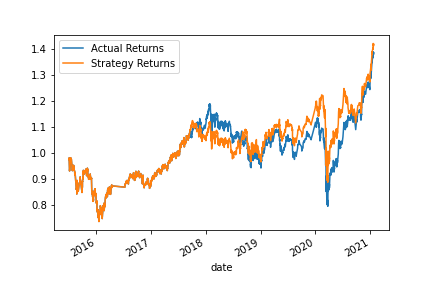
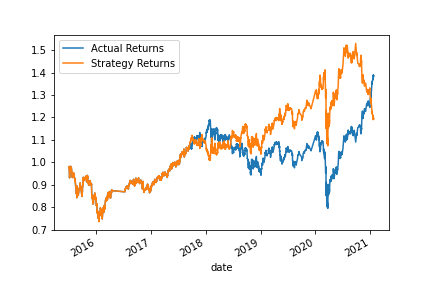

# Module 14 Report Template

## Overview of the Analysis

In this section, describe the analysis you completed for the machine learning models used in this Challenge. This might include:

The purpose of this analysis was to test multiple trading strategies and determine if we could optimize trading signals.  We started with an establish model, then optimized for new signals, and ultimately backtested our new strategy.  We built our established model with SMA_fast and SMA_slow signals.  We then transistioned to a Logistic Regression Model.

As part of this analysis, we loaded and cleaned the data with pandas.  We created training and testing data sets with the train/test/split module.  We then generated a predictive logistic regression model off of that training data.  Finally we compared that model's predictive capacity to the historical backtesting data.  

## Results

Using bulleted lists, describe the balanced accuracy scores and the precision and recall scores of all machine learning models.

* Machine Learning Model 1:
  * Precision Macro Average of 0.48
  * Actual returns conformed closer to strategy returns
  

* Machine Learning Model 2:
  * Precision Macro Average of 0.5
  * Actual returns had wider gap to strategy returns prediction

## Summary

Summarize the results of the machine learning models, and include a recommendation on the model to use, if any. For example:

Model 2 did not have as much as success as model 1.  You can see in the graph that model2's actual returns were not as close to the strategy returns.  Even though the original established model had less accurate prediction cababilites (only slightly by 0.02), it did produce stronger returns.  I would put my money in the established trading model.   

Model 1 Graph:

Model 2 Graph

